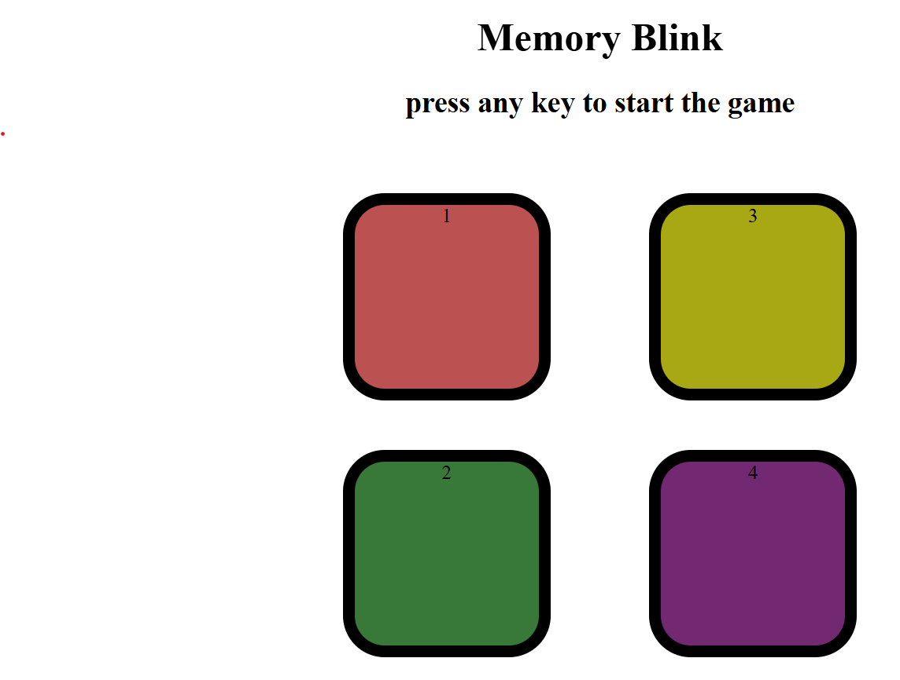

<h1 align="center">🎮 Memory Blink</h1>

  <i>A Fun & Addictive Simon Says Inspired Memory Game</i>  

---

## ✨ Overview
**Memory Blink** is an exciting memory challenge game where your brain is the ultimate weapon!  
Repeat the flashing sequence of colors and see how far you can go.  
Every round gets **faster** ⚡ and **trickier** 🧠.

---

## 🚀 Features
✅ Beautiful, colorful interface  
✅ Smooth animations & sound effects 🔊  
✅ Difficulty increases every round 📈  
✅ Fully responsive – play on any device 📱💻  

---

## 🎯 How to Play
1️⃣ Watch the sequence of blinking colors carefully 👀.  
2️⃣ Click the buttons in **exact same order** 🖱️.  
3️⃣ Pass each round to increase your score 🎯.  
4️⃣ One wrong move and… ❌ Game Over!  

---

## 🌐 Live Demo
👉 **[Play Now](https://your-live-demo-link.com)**  

---

## 🛠 Tech Stack
| Technology | Purpose |
|------------|---------|
| **HTML5**  | Structure |
| **CSS3**   | Styling & animations |
| **JavaScript** | Game logic |

---

## 📸 Screenshots

  

---

## 📜 License
This project is licensed under the **MIT License** – Free to use, modify & share.

---

Made with ❤️ by Lucky

